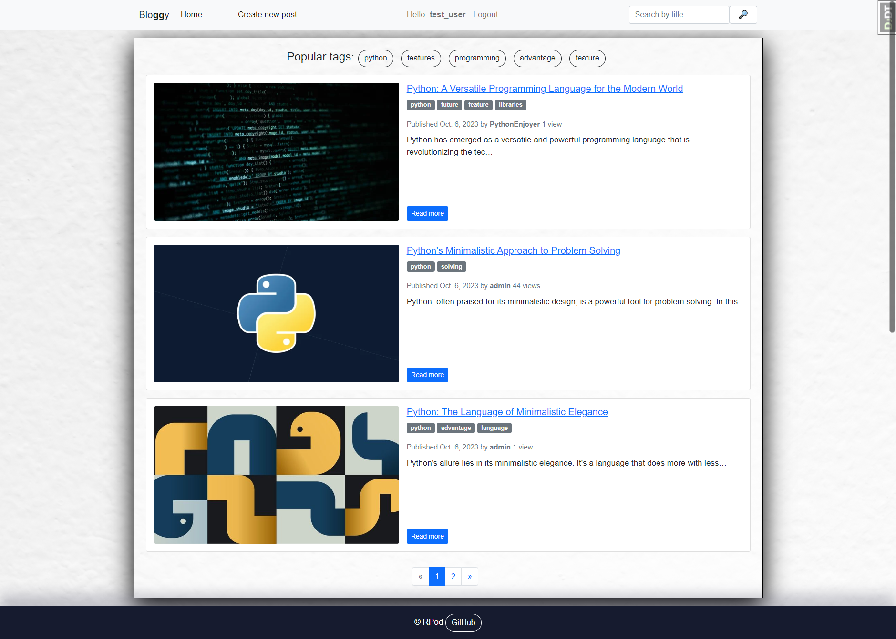

# Bloggy

This is simple django blog app with basic functions like:

### Check it out!
[Bloggy project deployed to Render](https://bloggy-7uor.onrender.com/)

### Test user
```
username: test_user
password: test_password
```

### Features
* Login and signup system
* Create new post
* Edit and delete own posts
* Browse posts by tag
* See similar posts on the post page
* Uploading post with images

### installation on Windows
```
git clone https://github.com/RPodolets/Blog.git
cd Blog
python venv venv
venv\Scripts\activate
pip install -r requirements.txt
python manage.py makemigrations
python manage.py migrate
python manage.py loaddata data.json
python manage.py runserver
``` 
### installation on Mac (and linux)
```
git clone https://github.com/RPodolets/Blog.git
cd Blog
python3 -m venv venv
source venv/bin/activate
pip install -r requirements.txt
python manage.py makemigrations
python manage.py migrate
python manage.py loaddata data.json
python manage.py runserver  
``` 
### Demo

